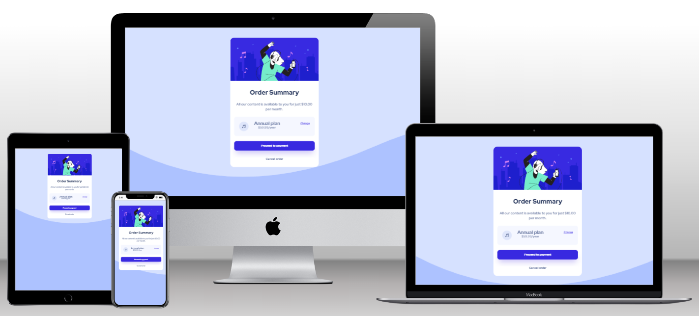

<a name="readme-top">Product Purchase Form</a>

<div align="center">
  
  <br/>

  <h3><b>Product Purchase Form</b></h3>

</div>

<!-- TABLE OF CONTENTS -->

# 📗 Table of Contents

- [📗 Table of Contents](#-table-of-contents)
- [📖 Product Purchase Form](#-product-purchase-form)
  - [🛠 Built With ](#-built-with-)
    - [Tech Stack ](#tech-stack-)
    - [Key Features ](#key-features-)
  - [🚀 Live Demo ](#-live-demo-)
  - [💻 Getting Started ](#-getting-started-)
    - [Prerequisites](#prerequisites)
    - [Setup](#setup)
    - [Install](#install)
    - [Usage](#usage)
    - [Run tests](#run-tests)
    - [Deployment](#deployment)
  - [👥 Authors ](#-authors-)
  - [🔭 Future Features ](#-future-features-)
  - [🤝 Contributing ](#-contributing-)
  - [⭐️ Show your support ](#️-show-your-support-)
  - [🙏 Acknowledgments ](#-acknowledgments-)
  - [❓ FAQ (OPTIONAL) ](#-faq-optional-)
  - [📝 License ](#-license-)

<!-- PROJECT DESCRIPTION -->

# 📖 Product Purchase Form<a name="about-project"></a>

The **Product Purchase Form** is a component created with HTML and CSS that implements the final step a customer takes to buy a product or service.

## 🛠 Built With <a name="built-with"></a>

### Tech Stack <a name="tech-stack"></a>

<details>
  <summary>Client</summary>
  <ul>
    <li><a href="https://developer.mozilla.org/es/docs/Learn/HTML">HTML</a></li>
    <li><a href="https://developer.mozilla.org/es/docs/Web/CSS">CSS</a></li>
  </ul>
</details>

<!-- Features -->

### Key Features <a name="key-features"></a>

- **Simulates a purchase component.**
- **It is responsive.**

<p align="right">(<a href="#readme-top">back to top</a>)</p>

<!-- LIVE DEMO -->

## 🚀 Live Demo <a name="live-demo"></a>


- [Live Demo Link](https://alejandroq12.github.io/buy-products/)

<p align="right">(<a href="#readme-top">back to top</a>)</p>

<!-- GETTING STARTED -->

## 💻 Getting Started <a name="getting-started"></a>

To get a local copy up and running, follow these steps.

### Prerequisites

To work with this project, you need:

1. A modern web browser to view the website (e.g., Google Chrome, Firefox, Safari, or Microsoft Edge).

2. A code editor for editing the code, such as Visual Studio Code, Atom, or Sublime Text.

<!--
Example command:

```sh
 gem install rails
```
 -->

### Setup

1. Clone it using your terminal:

```
git clone https://github.com/Alejandroq12/buy-products.git
```

### Install

For this porject you just need a web browser.

### Usage

To use this project locally on your computer, follow these steps:


1. Clone the repository or download the project files.
2. Navigate to the project directory where the index.html file is located.
3. Open the `index.html` file with a web browser.
- Optional: You can also use the Live Server extension for Visual Studio Code to view the website with live reloading.

-- Install the Live Server extension in Visual Studio Code.

-- Open the project folder in Visual Studio Code.

-- Right-click on the index.html file and select "Open with Live Server".

The website should now be displayed in your browser, and you can interact with the application as intended.

### Run tests

To run tests, run the following command:

- For hint:
```
npx hint .

```

### Deployment

You can deploy this project using GitHub pages:

1. Log in to your GitHub account and navigate to the repository that contains your website files.
2. Make sure that your website files are located in the main branch and in the root directory of the repository.
3. If your website is not already live, make sure that the index.html file is the main page of your website.
4. Click on the "Settings" tab in your repository.
5. Scroll down to the "GitHub Pages" section.
6. In the "Source" dropdown menu, select the branch where your website files are located. For a simple website with only HTML and CSS, this is typically the main branch.
7. In the "Path" field, make sure that the root directory is specified (i.e., "/").
8. Click "Save" to generate your website.
9. Wait a few minutes for GitHub to build and deploy your website.
10. Once the website is deployed, visit the GitHub Pages URL to view your site.

<p align="right">(<a href="#readme-top">back to top</a>)</p>

<!-- AUTHORS -->

## 👥 Authors <a name="authors"></a>

👤 **Julio Quezada**

- GitHub: [Alejandroq12](https://github.com/Alejandroq12)
- Twitter: [@JulioAle54](https://twitter.com/JulioAle54)
- LinkedIn: [Julio Quezada](https://www.linkedin.com/in/quezadajulio/)

<p align="right">(<a href="#readme-top">back to top</a>)</p>

<!-- FUTURE FEATURES -->

## 🔭 Future Features <a name="future-features"></a>

- [ ] **I will use JavaScript to make it interactive.**

<p align="right">(<a href="#readme-top">back to top</a>)</p>

<!-- CONTRIBUTING -->

## 🤝 Contributing <a name="contributing"></a>

Contributions, issues, and feature requests are welcome!

Feel free to check the [issues page](../../issues/).

<p align="right">(<a href="#readme-top">back to top</a>)</p>

<!-- SUPPORT -->

## ⭐️ Show your support <a name="support"></a>

If you like this project please give a star.
Thanks in advance.

<p align="right">(<a href="#readme-top">back to top</a>)</p>

<!-- ACKNOWLEDGEMENTS -->

## 🙏 Acknowledgments <a name="acknowledgements"></a>

I would like to thank Madison Kanna for guiding me in the creation of this project.

<p align="right">(<a href="#readme-top">back to top</a>)</p>

<!-- FAQ (optional) -->

## ❓ FAQ (OPTIONAL) <a name="faq"></a>

- **Will you use JavaScript to add interactivity?**

  - Of course, I will use it.

<p align="right">(<a href="#readme-top">back to top</a>)</p>

<!-- LICENSE -->

## 📝 License <a name="license"></a>

This project is [MIT](./LICENSE) licensed.

<p align="right">(<a href="#readme-top">back to top</a>)</p>
